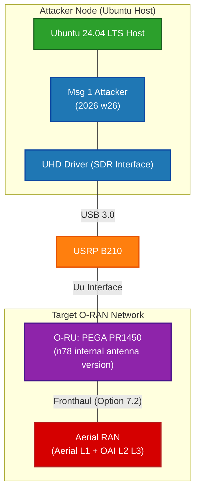

## Aerial attack test
## Table Of Contents
- [Aerial attack test](#aerial-attack-test)
- [Table Of Contents](#table-of-contents)
- [Scenario](#scenario)
- [Version](#version)
- [Step](#step)
  - [1.Start the Aerial container and attach](#1start-the-aerial-container-and-attach)
  - [2.Run Aerial L1 (inside the container) — and WAIT until it is fully up:](#2run-aerial-l1-inside-the-container--and-wait-until-it-is-fully-up)
  - [3.Run the OAI gNB (new terminal), only after L1 is ready:](#3run-the-oai-gnb-new-terminal-only-after-l1-is-ready)
  - [4.Start Attacker](#4start-attacker)
  - [Results](#results)


## Scenario

```bash
gNB: Aerial L1 + OAI L2 L3
O-RU: PEGA PR1450 , n78 internal antenna version
Split 7.2

band n78
40 MHz
SCS = 30 kHz
RB (Resourse Block) = 106 
center freq = 3748800000 (3.7488 GHz)
```


## Version
> [Refrence](https://github.com/bmw-ece-ntust/Metanoia-Internship/blob/master/aerial-ran/install-guide.md#-quickstart--everything-already-installed)


Full version table: [§13.2.](https://github.com/bmw-ece-ntust/Metanoia-Internship/blob/master/aerial-ran/setup-guide.md#132-software-versions)

Aerial cuBB 26-1, OAI `ARC1.7_integration`, CUDA 13.1, kernel `6.17.0-1014-nvidia`. 


## Step 
> Refrence: [Aerial RAN — Installation Guide](https://github.com/bmw-ece-ntust/Metanoia-Internship/blob/master/aerial-ran/install-guide.md#-quickstart--everything-already-installed)
### 1.Start the Aerial container and attach
```bash
# DGX-IA
# First Terminal

cd aerial-cuda-accelerated-ran/cuPHY-CP/container
./attach_aerial.sh


```

### 2.Run Aerial L1 (inside the container) — and WAIT until it is fully up:
```bash
# DGX-IA
# First Terminal

export cuBB_SDK=/opt/nvidia/cuBB
export CUDA_MPS_PIPE_DIRECTORY=/var/log/aerial/nvidia-mps
export CUDA_MPS_LOG_DIRECTORY=/var/log/aerial/nvidia-mps
export CUDA_DEVICE_MAX_CONNECTIONS=8

cd $cuBB_SDK/build.aarch64/cuPHY-CP/cuphycontroller/examples
sudo -E ./cuphycontroller_scf P5G_PEGA_DGX_ATTACK
```

### 3.Run the OAI gNB (new terminal), only after L1 is ready:
```bash
# DGX-IA
# Second Terminal

cd /home/admin/joshevan/AI-RAN_Config/OAI

CONF=$(realpath gnb-attacker.sa.band78.106prb.aerial.conf)

docker run -it --rm --name oai-gnb \
  --network host \
  --ipc=host \
  --cap-add=SYS_NICE \
  --cap-add=IPC_LOCK \
  --privileged \
  --cpuset-cpus="12,13,15,17,18,19" \
  -v /dev/shm:/dev/shm \
  -v "$CONF":/opt/oai-gnb/etc/gnb.conf:ro \
  oai-gnb-aerial:latest
```

### 4.Start Attacker
```bash
# oaiue
cd OAI-UE-MSG1-attacker/cmake_targets/ran_build/build/
sudo ./nr-uesoftmodem -C 3748800000 -r 106 --numerology 1 --band 78 --ssb 516 -E --ue-fo-compensation

 -C 3748800000 -r 106 --numerology 1 --band 78 --ssb 516
```


### Results


