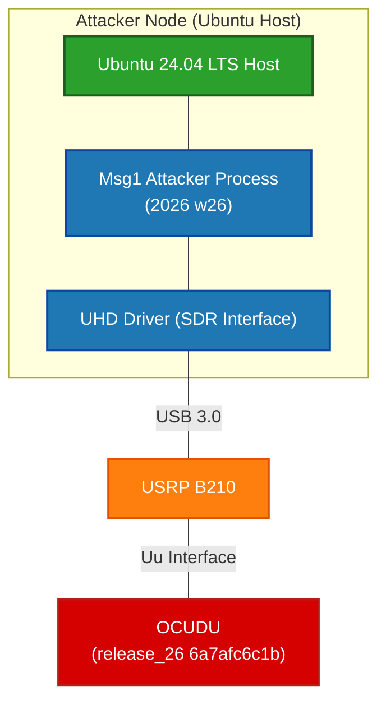

## OCUDU attack test
## Table Of Contents
- [OCUDU attack test](#ocudu-attack-test)
- [Table Of Contents](#table-of-contents)
- [Scenario](#scenario)
- [Step](#step)
  - [1.Start the gNB](#1start-the-gnb)
  - [2.Start Attacker](#2start-attacker)
  - [Results](#results)
  - [DEMO Video](#demo-video)

## Scenario
```bash
gNB: OCUDU gNB (release_26 6a7afc6c1b)

band n78
20 MHz
SCS = 30 kHz
RB (Resourse Block) = 51
center freq = 3619200000 (3.6192 GHz)
```


## Step 

### 1.Start the gNB
[config](./config/OCUDU_config.txt)
```bash
# oaignb

cd ~/ocudu/build/apps/gnb
sudo ./gnb -c gnb_rf_b200_tdd_n78_20mhz.yml

```

### 2.Start Attacker
```bash
# oaiue

cd OAI-UE-MSG1-attacker/cmake_targets/ran_build/build/
sudo ./nr-uesoftmodem -r 51 --numerology 1 --band 78 -C 3619200000 --ssb 42 -E --ue-fo-compensation --seq 3 --ue-txgain 0
```

### Results

### [DEMO Video](https://youtu.be/oIUZ0zYyGtk)
  
---

- **OCUDU preamble detection** mechanism uses the **average energy** within a window **as the threshold** (if the rate : **preamble energy / threshold > 1**, preamble will be detected).
- So if the number of preamble is too much, then the threshold will be much larger, so the preamble is getting hard to be detected.
- If we set the paremeter `rx_gain = 76`, then `dBFS = 1.1`.
- But if we set `rx_gain = 1`, then `dBFS = -60`.
